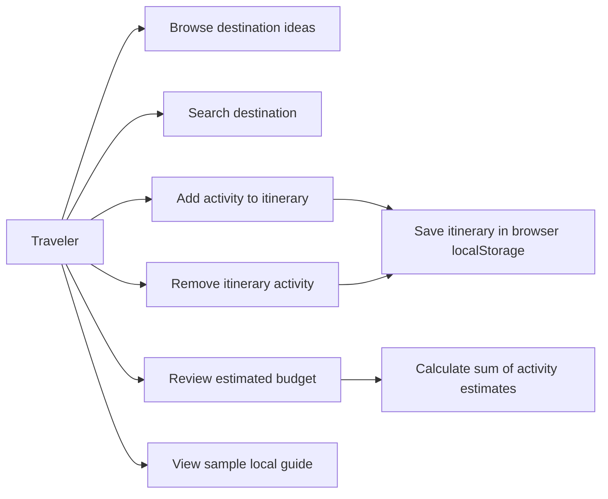
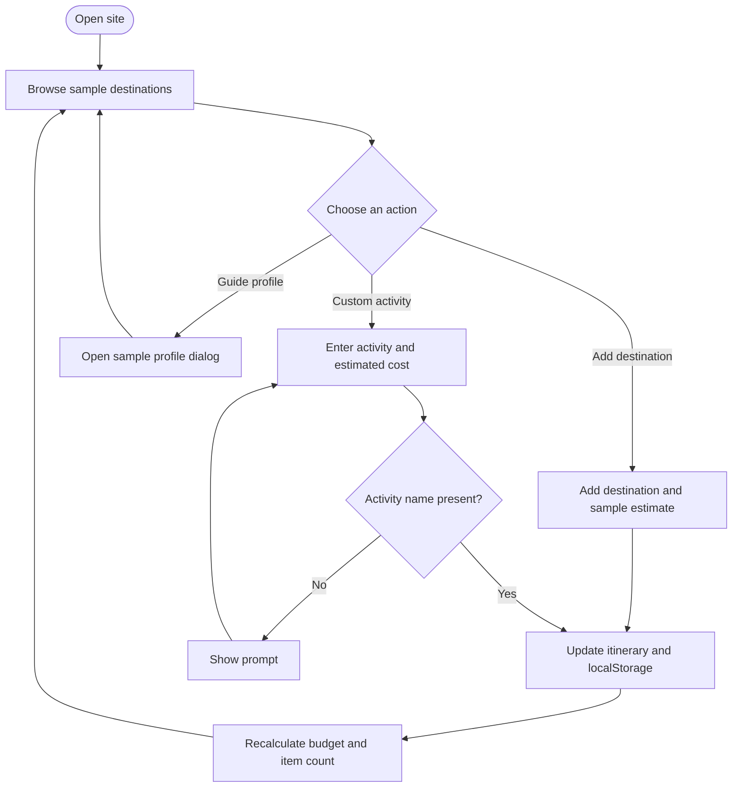
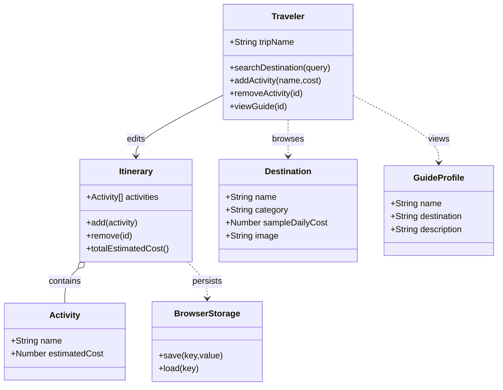

# UML Diagrams — Roamly

These diagrams describe the prototype's client-side scope, not a backend.

## Use case

```mermaid
flowchart LR
  T[Traveler] --> D[Browse destination ideas]
  T --> S[Search destination]
  T --> A[Add activity to itinerary]
  T --> R[Remove itinerary activity]
  T --> B[Review estimated budget]
  T --> G[View sample local guide]
  A --> L[Save itinerary in browser localStorage]
  R --> L
  B --> C[Calculate sum of activity estimates]
```

## Activity flow

```mermaid
flowchart TD
  Start([Open site]) --> Browse[Browse sample destinations]
  Browse --> Choice{Choose an action}
  Choice -->|Add destination| Add[Add destination and sample estimate]
  Choice -->|Custom activity| Form[Enter activity and estimated cost]
  Choice -->|Guide profile| Profile[Open sample profile dialog]
  Add --> Persist[Update itinerary and localStorage]
  Form --> Validate{Activity name present?}
  Validate -->|No| Error[Show prompt]
  Error --> Form
  Validate -->|Yes| Persist
  Persist --> Total[Recalculate budget and item count]
  Total --> Browse
  Profile --> Browse
```

## Domain class diagram

```mermaid
classDiagram
  class Traveler {
    +String tripName
    +searchDestination(query)
    +addActivity(name,cost)
    +removeActivity(id)
    +viewGuide(id)
  }
  class Itinerary {
    +Activity[] activities
    +add(activity)
    +remove(id)
    +totalEstimatedCost()
  }
  class Activity {
    +String name
    +Number estimatedCost
  }
  class Destination {
    +String name
    +String category
    +Number sampleDailyCost
    +String image
  }
  class GuideProfile {
    +String name
    +String destination
    +String description
  }
  class BrowserStorage {
    +save(key,value)
    +load(key)
  }
  Traveler --> Itinerary : edits
  Itinerary o-- Activity : contains
  Traveler ..> Destination : browses
  Traveler ..> GuideProfile : views
  Itinerary ..> BrowserStorage : persists
```
